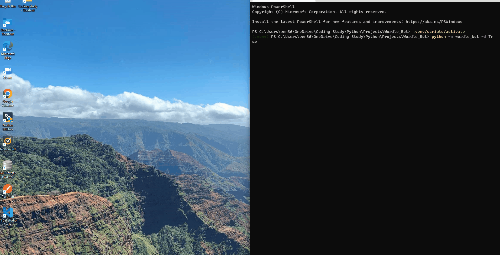

# Bruteforce_Wordle_Bot
Python bot created with Selenium that finds the word of the day through process of elimintaiton. 
* main.py is the entry point to the bot.
* 70% of the time the bot should find the word within the 6 attempts. 
* If it does not, a new browser session is launched to continue solving. 


</img>



Bruteforce Algorithm:
----------------------

Algorithm is handled in the WordHandler class. 
The process is as follow: 
1) The first two guess are optimized words for elimination, words sourced from [wired.com's article here.](https://www.wired.com/story/best-wordle-tips/#:~:text=If%20you%20start,with%20SENOR%2C%20DUCAT)
2) iterate through word list, for each word:
    * If the word does not contain a known value at the known index, remove it from the list.
    * If the word does not contian a present letter, remove it form the list.
    * If the word contains a absent letter, remove it form the list.
3) Use random.choice to select the new word form the filtered list. 
* Note: There is a lot of room for improvement here, such as not using random and calculating probability, but that was not the intent of this project. 

Web Driver
----------
The WordleWebDriver class handles all interactions with the site.
An instance of the WordHandler class is encapsulated here for ease of updating known letter indexes, present letters and absent letters. 
* display_page boolean toggles wether the chrome driver should run in the background or not.

Within the check letters method, if each letter of the guess is reported as correct on the keyboard it is assumed that the guess was correct. There is a chance that this could be inaccurate on some occasions. 

Note: To select the keyboard data i used a regular expresion logic and scripts to selected the sub elements within the shadow tree. This logic was sourced from another project. Credit to github user [Polidori-112](https://github.com/Polidori-112), checkout his Wordle_Bot [here](https://github.com/Polidori-112/Wordle_Bot).

notify.py - send_sms_notification
----------------------------------
* Optional. Will send a text message to your default number, can be used of scheduled otherwise the print statement will suffice.  
Dependencies: 
Twillo is deppended on the .env file saved in root folder. Contents of .env file below:
```
TWILIO_ACCOUNT_SID=Your_Twillo_Account_SID
TWILIO_AUTH_TOKEN=Your_Twillo_Auth_Token
TWILLO_FROM=Your_Tiwllo_From_Number
TWILLO_TO=Your_Twillo_To_Number
```

Word Lists
----------
The word list is all 5 letter words downloaded from [The Stanford GraphBase: A Platform for Combinatorial Computing](https://www-cs-faculty.stanford.edu/~knuth/sgb.html). 
I thought it would be two easy to use the same words as Wordle.

References
---
* [www.wired.com](https://www.wired.com/story/best-wordle-tips/#:~:text=If%20you%20start,with%20SENOR%2C%20DUCAT)
* [The Stanford GraphBase: A Platform for Combinatorial Computing](https://www-cs-faculty.stanford.edu/~knuth/sgb.html). 

